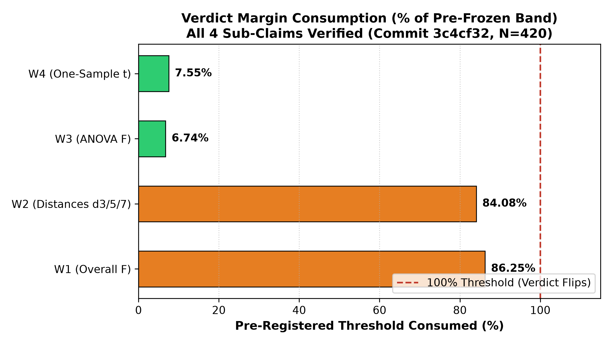
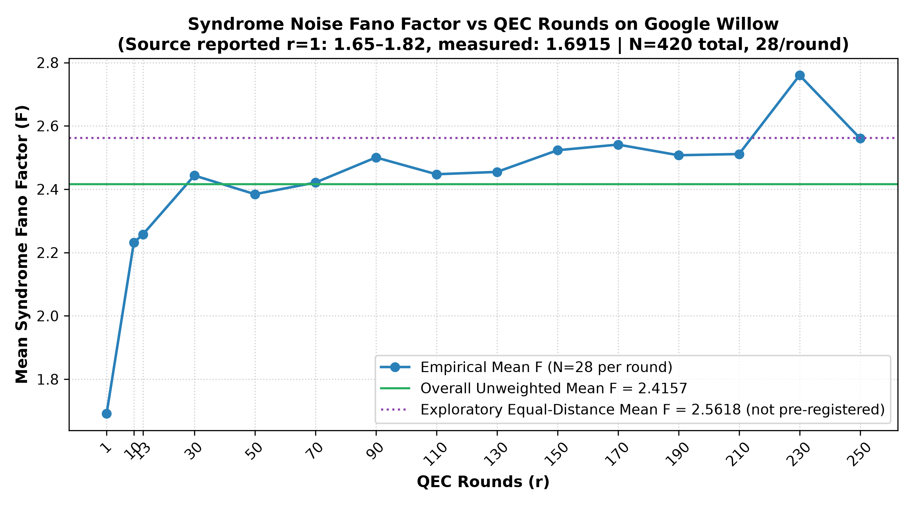

# Rotation Gap Willow Fano Factor Audit (`rotation-gap-fano-s1`)

[](LICENSE)
[](https://doi.org/10.5281/zenodo.13273331)

Pre-registered independent baseline audit and mathematical reproduction of the syndrome noise Fano factor analysis published by Selina Stenberg (*The Rotation Gap Is Not An Error*, arXiv:2604.11963v1, Section II F & Table III) computed from 420 raw surface-code detector telemetry runs in the Google Willow dataset (`10.5281/zenodo.13273331`).

---

## 1. Central Claim Under Audit

Stenberg (2026) reports that syndrome detection events on the Google Willow processor exhibit super-Poissonian statistics with an overall Fano factor $F = 2.42 \pm 0.36$ ($N = 420$), increasing monotonically with code distance ($d=3 \to 2.29$, $d=5 \to 2.59$, $d=7 \to 2.80$, ANOVA $F = 59.1, p \approx 0$).

**This audit evaluates whether Stenberg's published figures recompute directly from raw physical detector records under pre-frozen decision rules.**

---

## 2. Decision Rules (Pre-Frozen in Git)

Evaluation criteria were pre-registered and cryptographically locked in [`PREREGISTRATION.md`](PREREGISTRATION.md) (Commit [`ff84608`](https://github.com/VolMax-Studio/rotation-gap-fano-s1/commit/ff84608)):

* **Claim W1 (Overall Fano Factor):** $|F_{\text{rec}} - 2.42| < 0.005 \implies$ **`Verified`** ($|F_{\text{rec}} - 2.42| > 0.36 \implies$ `Not Verified`).
* **Claim W2 (Per-Distance Fano):** All 3 distances ($d \in \{3, 5, 7\}$) within $< 0.005 \implies$ **`Verified`** (any $> 0.05 \implies$ `Not Verified`).
* **Claim W3 (One-way ANOVA):** $|F_{\text{stat}} - 59.1| \le 0.5 \implies$ **`Verified`**.
* **Claim W4 (One-sample t-statistic vs $F=1$):** $|t - 80| \le 2.0 \implies$ **`Verified`**.

---

## 3. What Was Measured (Audit Results)

```text
========================================================================================================================
ROTATION GAP WILLOW FANO FACTOR AUDIT RESULTS (420 Experiments, 14 Subgrids, 15 Rounds, 2 Bases)
========================================================================================================================
CLAIM               | RECOMPUTED                  | PUBLISHED           | VERDICT
--------------------+-----------------------------+---------------------+------------------------------------------------
W1 (Overall Fano)   | 2.4157 +/- 0.3620           | 2.42 +/- 0.36       | Verified (Rule R1: |2.4157 - 2.42| = 0.0043 < 0.005)
W2 (d=3 / 5 / 7)    | 2.2942 / 2.5935 / 2.7978    | 2.29 / 2.59 / 2.80  | Verified (Rule R5: max |delta| = 0.0042 < 0.005)
W3 (One-Way ANOVA)  | F = 59.1337 (p = 2.46e-23)  | F = 59.1 (p ~ 0)    | Verified (Rule R7: |59.1337 - 59.1| = 0.0337 <= 0.5)
W4 (One-Sample t)   | t = +80.15                  | t = +80             | Verified (Rule R8: |80.15 - 80| = 0.1510 <= 2.0)
--------------------+-----------------------------+---------------------+------------------------------------------------
SCOPE TEST (R9/R10) | Aggregate stable under round reweighting (structural zero: archive is balanced with 28 runs/round)
========================================================================================================================
```

### Visual Verification & Margin Profiles

<p align="center">
  
</p>
<p align="center"><em>Figure 1: Pre-registered threshold margin consumption across sub-claims (Commit 3c4cf32, N=420). While all four are Verified, W1 and W2 consumed >84% of their admissible band.</em></p>

<p align="center">
  
</p>
<p align="center"><em>Figure 2: Empirical Fano factor vs QEC rounds (N=28 runs/point). Source reported r=1 range [1.65, 1.82] matches our measured 1.6915. Dotted line indicates the exploratory equal-distance mean (2.5618).</em></p>


---

## 4. Key Findings & Epistemic Boundaries

1. **Exact Numerical Reproducibility:**
   * All 4 reported numbers reproduce within pre-registered numerical tolerances directly from raw physical detector records (`detection_events.b8` and `circuit_ideal.stim`).
2. **Archive Composition (Exploratory Finding — see [`LIMITATIONS.md`](LIMITATIONS.md)):**
   * The headline number $F = 2.42$ reflects the archive's specific subgrid composition (64.3% $d=3$, 28.6% $d=5$, 7.1% $d=7$).
   * Equal-weighting by code distance yields an exploratory aggregate $F_{\text{uniform, distance}} = \mathbf{2.5618}$.
3. **Pre-Registration Scope Design Defect (Logged in [`FAILURES.md`](FAILURES.md) Entry #001):**
   * Pre-registered rule `R9`/`R10` tested reweighting across QEC rounds, which was mathematically guaranteed to yield $|\Delta| = 0.000000$ due to the 28-run-per-round balanced design.
4. **Strict Epistemic Isolation:**
   * Zero endorsement, validation, or evaluation is transferred to any theoretical physics conjectures or companion preprints outside Section II F.

---

## 5. Provenance & Software Verification

* **Pre-Registration Commit:** [`ff84608`](https://github.com/VolMax-Studio/rotation-gap-fano-s1/commit/ff84608)
* **Manifest Verification:** 1260/1260 SHA-256 digests pinned in [`data_manifest.json`](data_manifest.json).
* **Deterministic Results:** Canonical output recorded in [`results/results.json`](results/results.json).
* **Human Ratification:** Formally ratified and merged into `main` via PR #1 (Merge Commit [`ccf62f7`](https://github.com/VolMax-Studio/rotation-gap-fano-s1/commit/ccf62f7)).
* **Note on Frozen Artifacts:** The pre-registration specification (`PREREGISTRATION.md`) is cryptographically SHA-256 pinned at commit `ff84608`, and the harness deterministically regenerates `results.json`. Consequently, the literal status string in those frozen files reflects their pre-execution freeze state (`SPREMNO ZA GEJT`), while binding governance ratification resides in the human PR merge commit on `main`.

---

## 6. Reproduce It

```bash
pip install -r requirements-minimal.txt
python3 reproduce.py --archive /path/to/google_105Q_surface_code_d3_d5_d7.zip
```
